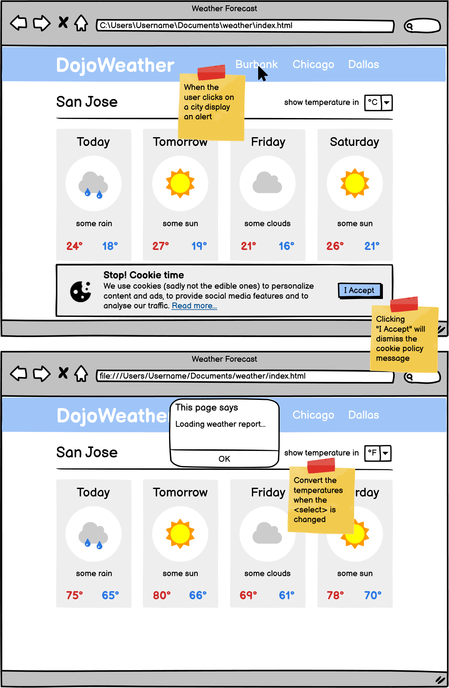

# Dojo Weather
This was an assignment completed for Coding Dojo. I was given a wireframe and a list of features to implement.
### Objectives:
* Recreate the look of the Weather Forecast page using HTML and CSS
* Use `position: fixed` to position the cookie policy message at the bottom of the page.
* When a user clicks on a city, alert the message "Loading weather report..."
* Whent he user accepts the cookie policy, hide the cookie message
### Additional functionality for extra practice:
* **Challenge** when the user changes the `<select>`, convert the temperature from Celsius to Fahrenheit
## I was given this wireframe as a reference:

